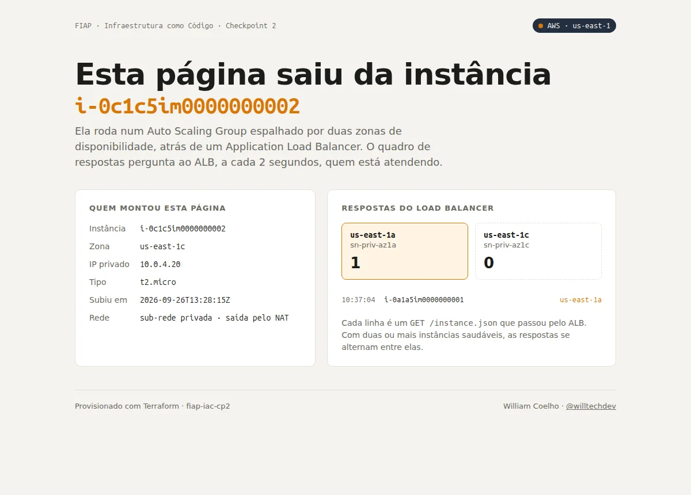
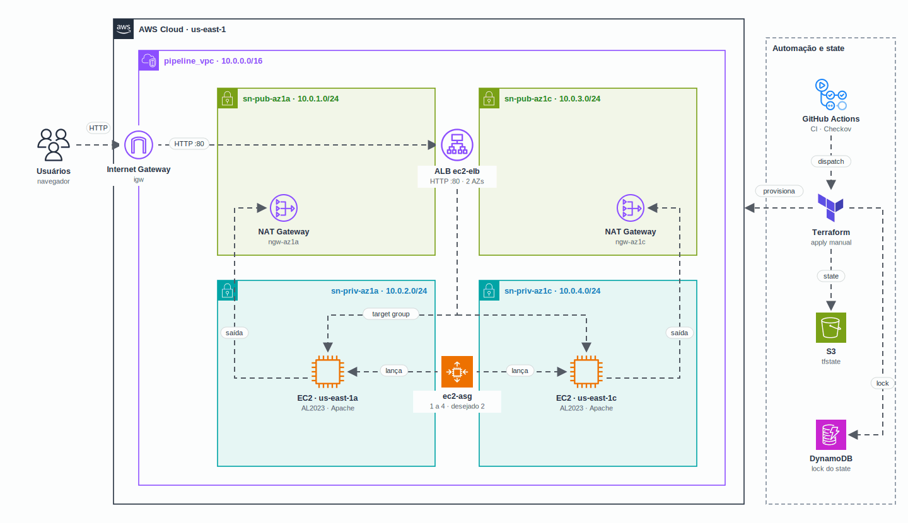

<h1 align="center">
  CP2 · Infraestrutura AWS completa com Terraform e pipeline
</h1>

<p align="center">
  
</p>

<p align="center">
  <a href="https://skillicons.dev">
    
  </a>
</p>

## Qual a finalidade do projeto?

Checkpoint 2 da disciplina de **Infraestrutura como Código** (FIAP, setembro de 2024). O desafio era criar uma **infraestrutura completa na AWS só com Terraform e um pipeline do GitHub Actions**: uma VPC com sub-redes públicas e privadas em duas zonas de disponibilidade, um **Application Load Balancer** público e um **Auto Scaling Group** de instâncias EC2 nas sub-redes privadas, com o state guardado num **backend S3 + DynamoDB**.

O código é dividido em dois **módulos** (`network` e `compute`) ligados pelo módulo raiz, que passa os IDs da rede para o compute.

Este repositório é a versão organizada da entrega: os bugs encontrados foram corrigidos, o que faltava foi completado (os outputs do compute estavam vazios), o Checkov que estava comentado passou a rodar e o pipeline deixou de aplicar a cada push.

## Arquitetura

<p align="center">
  
</p>

## O que foi construído

### Módulo `network`

| Recurso | Nome | Detalhe |
|---|---|---|
| VPC | `pipeline_vpc` | `10.0.0.0/16` |
| Sub-redes públicas | `sn-pub-az1a`, `sn-pub-az1c` | `10.0.1.0/24` e `10.0.3.0/24`, em `us-east-1a` e `us-east-1c` |
| Sub-redes privadas | `sn-priv-az1a`, `sn-priv-az1c` | `10.0.2.0/24` e `10.0.4.0/24` |
| Internet Gateway | `igw` | saída das sub-redes públicas |
| NAT Gateways + EIPs | `ngw-az1a`, `ngw-az1c` | um por AZ, cada um na sub-rede pública da sua zona |
| Route tables | `rt-pub`, `rt-priv-az1a`, `rt-priv-az1c` | pública para o IGW; cada privada para o NAT da própria AZ |
| SG default | `sg-default-bloqueado` | security group padrão da VPC sem nenhuma regra |

### Módulo `compute`

| Recurso | Nome | Detalhe |
|---|---|---|
| Security group do ALB | `sg_elb` | HTTP 80 da internet |
| Security group das EC2 | `sg_ec2` | HTTP 80 **só vindo do `sg_elb`** |
| Application Load Balancer | `ec2-elb` | público, nas duas sub-redes públicas, descarta headers inválidos |
| Target group + listener | `tg-ec2-elb`, `elb_listener` | HTTP 80, health check em `/` |
| Launch template | `app-dynamicsite` | Amazon Linux 2023 mais recente, `t2.micro`, **IMDSv2 obrigatório**, userdata com Apache |
| Auto Scaling Group | `ec2-asg` | mínimo 1, desejado 2, máximo 4, nas sub-redes privadas, com instance refresh |

### Página servida pelas instâncias

O `userdata.sh` instala o Apache, lê instance-id, zona, IP e tipo pelo **IMDSv2** e grava uma página com esses dados e um `instance.json`. A página consulta o `instance.json` a cada 2 segundos, sempre pelo ALB, e mostra quem respondeu: com duas instâncias saudáveis, as respostas alternam entre `us-east-1a` e `us-east-1c`.

### Mudanças em relação à entrega

| O que era | O que ficou | Por quê |
|---|---|---|
| ALB `internal = false` nas sub-redes **privadas** | ALB nas sub-redes públicas | um ALB público precisa de sub-redes com rota para o Internet Gateway |
| Rotas privadas com o NAT em `gateway_id` | `nat_gateway_id` | `gateway_id` é o campo do Internet Gateway; o NAT tem atributo próprio |
| SG das EC2 com a porta 80 aberta para `0.0.0.0/0` | só o SG do ALB | as instâncias ficam atrás do load balancer |
| `data "template_file"` com caminho `./modules/...` | `filebase64("${path.module}/...")` | provider `template` arquivado; caminho só funcionava rodando de dentro de `terraform/` |
| userdata clonava um repositório de terceiros para copiar um `phpinfo.php` | página própria, sem dependência externa | nada de código de fora baixado na inicialização |
| AMI fixa (Amazon Linux 2 de 2021) e `key_name = "vockey"` | data source da AL2023 e `key_name` opcional | AMI antiga e key pair que só existe no AWS Academy |
| `compute/output.tf` vazio | outputs do ALB, target group, ASG e AMI, e `site_url` na raiz | faltava a URL para acessar o site |
| Variáveis sem tipo, portas como texto e nomes com `imput` | tipos, descrições em português e `input` | leitura e validação |
| Backend com o bucket e a tabela no código | backend parcial + `backend.hcl.example` | nomes da conta fora do repositório |
| Checkov comentado e pipeline com `apply` (e no fim `plan -destroy`) a cada push | CI com fmt, validate, test e Checkov sem credenciais + deploy manual | nenhum push mexe na AWS |

### Pipeline

| Workflow | Quando | O que faz | Credenciais |
|---|---|---|---|
| `terraform-ci.yaml` | todo push e PR | `fmt -check`, `init -backend=false`, `validate`, `terraform test`, Checkov e simulação do ASG com Docker | nenhuma |
| `terraform-deploy.yaml` | manual (`workflow_dispatch`) | `plan`, `apply` ou `destroy` | secrets da AWS e do backend |

### Checkov

O `.checkov.yaml` roda com **0 falhas**. As exceções ficam listadas nele com o motivo: sem domínio nem certificado no laboratório (HTTPS no ALB), o ALB é a porta pública do site (porta 80 aberta só no `sg_elb`) e itens de custo fora do escopo (WAF, access logs, flow logs, deletion protection).

## Tecnologias utilizadas

- **Terraform 1.9:** módulos, backend S3 com lock no DynamoDB, provider `hashicorp/aws ~> 5.64` e `terraform test` com `mock_provider`;
- **AWS:** VPC, sub-redes, Internet Gateway, NAT Gateway, route tables, security groups, ALB, launch template, Auto Scaling Group e EC2;
- **GitHub Actions:** CI sem credenciais e deploy manual;
- **Checkov:** análise estática de segurança do Terraform;
- **Amazon Linux 2023 + Apache:** imagem e servidor web das instâncias;
- **Bash, HTML e CSS:** userdata e página, sem bibliotecas externas;
- **Docker, Python e nginx:** simulação local do ASG (IMDSv2 falso em Python, nginx no papel do ALB).

## Estrutura do repositório

```text
fiap-iac-cp2/
├── terraform/
│   ├── main.tf                       # liga os módulos network e compute
│   ├── provider.tf                   # provider e backend S3 parcial
│   ├── variables.tf / outputs.tf     # variáveis da raiz e site_url
│   ├── backend.hcl.example           # bucket, key e tabela de lock do state
│   ├── terraform.tfvars.example      # key pair e tamanho do ASG
│   ├── tests/cp2.tftest.hcl          # terraform test com provider simulado
│   └── modules/
│       ├── network/                  # VPC, sub-redes, IGW, NAT e rotas
│       └── compute/                  # SGs, ALB, launch template, ASG
│           └── scripts/userdata.sh   # Apache + página
├── tests/local/                      # simulação do ASG com Docker
├── .checkov.yaml                     # exceções do Checkov com justificativa
├── .github/workflows/
│   ├── terraform-ci.yaml             # validação sem credenciais
│   └── terraform-deploy.yaml         # plan/apply/destroy manual
└── docs/                             # diagrama e demo
```

## Fluxo de funcionamento

1. Um push ou PR dispara o **Terraform CI**: formatação, validação, `terraform test`, Checkov e a simulação com Docker, sem credencial.
2. O **Terraform Deploy** é disparado à mão com `plan`, `apply` ou `destroy`; o state fica no S3 com lock no DynamoDB.
3. O módulo `network` cria a VPC, as quatro sub-redes, o Internet Gateway, um NAT Gateway por AZ e as route tables.
4. O módulo `compute` recebe os IDs da rede e cria os security groups, o ALB nas sub-redes públicas, o launch template e o ASG nas privadas.
5. Cada instância sobe, instala o Apache pelo NAT e grava a página com seus metadados, lidos pelo IMDSv2.
6. O ALB só manda tráfego para instâncias que passam no health check; o usuário abre o `site_url` e vê as respostas alternando entre as zonas.

## Como rodar

> Os NAT Gateways, o ALB e as EC2 são cobrados por hora. Rode `destroy` ao terminar.

### Pelo GitHub Actions

Cadastre em **Settings > Secrets and variables > Actions**:

| Nome | Tipo | Uso |
|---|---|---|
| `AWS_ACCESS_KEY_ID`, `AWS_SECRET_ACCESS_KEY`, `AWS_SESSION_TOKEN` | secret | credenciais (no AWS Academy, as da sessão do lab) |
| `TF_STATE_BUCKET`, `TF_STATE_LOCK_TABLE` | secret | bucket S3 e tabela DynamoDB do state |
| `AWS_KEY_NAME` | variable | key pair das instâncias (opcional, ex.: `vockey`) |

Depois: **Actions > Terraform Deploy > Run workflow**.

### Na sua máquina

O bucket S3 e a tabela DynamoDB (chave de partição `LockID`, tipo String) precisam existir antes.

```bash
cd terraform
cp backend.hcl.example backend.hcl                 # troque pelos seus recursos
cp terraform.tfvars.example terraform.tfvars       # opcional
terraform init -backend-config=backend.hcl
terraform plan
terraform apply
terraform output site_url                          # abra no navegador
terraform destroy
```

Sem Terraform instalado, dá para usar a imagem oficial:

```bash
docker run --rm -v "$PWD":/w -w /w hashicorp/terraform:1.9 -chdir=terraform init -backend=false
```

## Como validar a entrega

Tudo abaixo roda sem conta na AWS. Este repositório **não foi aplicado na AWS** depois da reorganização: a validação foi feita com os comandos a seguir.

```bash
terraform fmt -check -recursive
terraform -chdir=terraform init -backend=false
terraform -chdir=terraform validate
terraform -chdir=terraform test        # 3 passed (network, compute e raiz)
checkov --config-file .checkov.yaml    # Passed checks: 34, Failed checks: 0
tests/local/simular.sh                 # página em http://localhost:18390
tests/local/simular.sh down
```

O que o `terraform test` confere, com o provider da AWS simulado:

- sub-redes públicas e privadas em `us-east-1a` e `us-east-1c`, cada NAT na pública da sua AZ;
- cada route table privada saindo pelo NAT da própria AZ (`nat_gateway_id`);
- SG default da VPC sem regras;
- ALB público nas sub-redes públicas e ASG nas privadas;
- instâncias aceitando tráfego só do SG do ALB;
- launch template com a AMI do data source, IMDSv2 obrigatório e userdata usando token;
- target group com health check em `/` e `site_url` saindo na raiz.

A simulação sobe duas "instâncias" Amazon Linux 2023 em Docker que rodam o `userdata.sh` de verdade, um IMDSv2 falso que responde metadados diferentes para cada uma (e recusa pedidos sem token) e um nginx no papel do ALB. O resultado esperado:

```text
  ok    página responde pelo ALB
  ok    ALB alterna entre as duas instâncias (2 distintas em 6 requisições)
  ok    instâncias em AZs diferentes
  ok    IMDS sem token recusado (IMDSv2)
```

A demo no topo foi gravada nessa simulação; por isso os IDs de instância são fictícios.

## Autor

**William Coelho** · RM 556336 · [@willtechdev](https://github.com/willtechdev)
